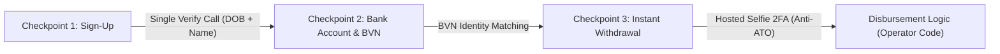

# ninja-bet: Technical & Product Specification (V2)

> **Document Version:** 2.0  
> **Status:** Approved Architecture (Reflecting Executive Feedback from Technical Director Okechukwu Ugwu)  
> **Target Audience:** External Software Engineers, Integrators, and Fintech/iGaming CTOs evaluating Ninja API.

---

## 1. Executive Summary & Core Objective

**ninja-bet** is not an actual sportsbook; it is a **developer magnet and live integration blueprint** demonstrating how Nigerian iGaming and Fintech operators integrate **Ninja API** into their platforms.

Its purpose is to teach developers how to solve identity verification with zero friction, directly answering:
- *What endpoints do I call?*
- *When in the user lifecycle do I call them?*
- *What code runs before and after each checkpoint?*
- *How do I handle liveness, BVN ownership, and AML age compliance?*

---

## 2. What Was Wrong With the Previous Approach (Post-Mortem)

Based on the executive review session, the previous approach suffered from 8 fundamental flaws:

| Area | Previous Flawed Approach | New V2 Approach |
| :--- | :--- | :--- |
| **1. Product Philosophy** | Simulated a full betting company (fixtures, odds slips, leagues, legal disclaimers). | **Developer-First Demo**: Strips out gaming fluff; laser-focused on the 3 Ninja integration checkpoints. |
| **2. Registration API** | Ran 2 separate calls (`lookup` to fetch raw data + `verify` to match names). | **1 Single Verification Call**: `POST /api/identity/identify` with `mode: "verify"`, matching name + verifying age $\ge 18$ via DOB. |
| **3. Developer UX (DX)** | Code snippets were buried in collapsed sidebars; clicking buttons silently triggered actions. | **Code-First Inspection Modal / Slide-out**: Clicking an action reveals the exact request code *first*. Developer clicks *"Noted, Proceed"* to run it. |
| **4. Onboarding Tour** | Intrusive, unskippable full-screen tour overlay with fixed cutout holes that covered buttons. | **Self-Paced Checkpoint Stepper**: Clear 3-step progress bar (Sign-up $\rightarrow$ Bank BVN $\rightarrow$ Withdrawal). Never blocks the UI or inspect element. |
| **5. Architecture** | Multi-page traditional setup (`register.html`, `login.html`, `play.html`) causing reloads. | **True Single-Page Application (SPA)**: Unified responsive interface with reactive state. |
| **6. State Management** | Rigid SQLite database queries leading to duplicate NIN lockouts and ₦0 bonus penalties. | **Browser Storage (`localStorage`) First**: Zero database lockouts, instant 1-click resets, GitHub Pages ready. |
| **7. Hosted Selfie Links** | Generated generic links asking users to re-type their names into Ninja. | **Pre-Filled Flow Links**: Pre-populates `values` with verified customer name; provides 3 developer scenario options. |
| **8. Wallet Simulation** | Forced users to place bets to convert non-withdrawable bonus credit to withdrawable funds. | **Simulation Parameters Box**: Explicit gray box on sign-up allowing developers to choose starting wallet balance (e.g. ₦10,000 or ₦250,000). |

---

## 3. The 3 Core Ninja Checkpoints

In an iGaming/sportsbook platform, Ninja comes into play at exactly **three lifecycle moments**:



### Checkpoint 1: Player Registration & Age Compliance (NIN Verification)
- **Business Problem:** Under NLRC regulations, operators must ensure players are $\ge 18$ years old and genuine individuals, preventing synthetic identities and underage signups.
- **Ninja Endpoint:** `POST /api/identity/identify`
- **Mode:** `verify`
- **Request Payload:**
  ```json
  {
    "idType": "nin",
    "mode": "verify",
    "idNumber": "77777777777",
    "firstName": "James",
    "lastName": "Bond",
    "dateOfBirth": "1975-01-01"
  }
  ```
- **Response Handling:**
  - `verified: true` and age $\ge 18$: Player verified; proceed to account dashboard.
  - `verified: false`: Immediate rejection with field-level mismatch indicator.
  - Age $< 18$: Blocked under underage gambling regulations.
- **Developer Teaching Moment:**
  - *Why not lookup?* Lookup returns raw, unverified data. Verification matches what the customer claimed against the authoritative government database synchronously.

### Checkpoint 2: Payout Account & BVN Ownership Verification
- **Business Problem:** Fraudsters register under one name and attempt to withdraw funds into a stolen or mule bank account under a different name.
- **Ninja Endpoint:** `POST /api/identity/identify`
- **Mode:** `verify`
- **Request Payload:**
  ```json
  {
    "idType": "bvn",
    "mode": "verify",
    "idNumber": "77777777777",
    "firstName": "James",
    "lastName": "Bond"
  }
  ```
- **Operator Logic:**
  - Ninja confirms whether the BVN belongs to the registered player.
  - If match $\rightarrow$ Bank account is saved on file for future withdrawals.
  - If mismatch $\rightarrow$ Block account addition; trigger alert: *"BVN name does not match registered player identity"*.

### Checkpoint 3: High-Value Withdrawal & Layer-2 Biometric 2FA
- **Business Problem:** Account Takeover (ATO). Even if a fraudster compromises a player's credentials or session, they cannot forge live facial biometrics.
- **Ninja Endpoint:** `POST /api/flows/{flow_id}/links`
- **Request Payload:**
  ```json
  {
    "customer_name": "James Bond",
    "customer_ref": "player_8921:wtd_9021",
    "values": {
      "first_name": "James",
      "last_name": "Bond"
    }
  }
  ```
- **Three Developer Scenarios to Showcase:**
  1. **Pre-filled Form (Recommended):** Player name and details are passed in `values`; the user only performs the live liveness selfie.
  2. **Unfilled Form:** Ninja collects all details from scratch (cold verification).
  3. **Custom Requirements:** Restricting allowed documents or configuring liveness strictness tiers (Low: 70%, Medium: 85%, High: 95%).
- **Operator Disbursement Logic:**
  - Ninja verifies selfie against government registry portrait.
  - Only upon `outcome: "passed"` does the operator's payout execution code run.

---

## 4. The "Code-First Step Confirmation" Pattern

To bridge the gap between UI interaction and API execution, ninja-bet implements the **Code-First Inspection Drawer/Modal**:

1. **User clicks an Action Button** (e.g. *"Verify NIN & Create Account"* or *"Execute Withdrawal"*).
2. Instead of immediately firing the request, an elegant, compact slide-out appears:
   - **Title:** `POST /api/identity/identify` (NIN Verification)
   - **Payload Inspector:** Exact JSON payload with syntax highlighting (cURL, TypeScript, Python, Go tabs).
   - **Explanation:** Why this endpoint is called and how the response should be handled.
3. **User Action:** Clicks **`[ Proceed with Request → ]`** to execute the live call.
4. **Live Response:** Shows the exact response received from Ninja API (with match scores and verification status) before advancing state.

---

## 5. UI/UX Architecture & Layout Spec

The interface is structured as a **single responsive viewport** without jarring navigation jumps:

### Top Navigation Bar
- **Brand Logo:** `ninja-bet-dark-bg.png` (transparent background).
- **Environment Badge:** `Ninja Sandbox Active` (pulsing emerald indicator).
- **Interactive Checkpoint Stepper:**
  - `[ 1. Player Verification ]` $\rightarrow$ `[ 2. Bank Account & BVN ]` $\rightarrow$ `[ 3. Biometric Withdrawal ]`
- **Header Actions:**
  - `[ ↺ Reset Demo ]` (Clears localStorage and resets to Step 1).
  - `[ Active Player / Wallet Balance Pill ]`.

### Main Workspace (Split View)
- **Left Column (45% width): Interactive Operator Interface**
  - Step 1: Sign-up form with quick test presets (Adult Pass, Name Mismatch, Underage) + **Simulation Parameters** box (wallet balance slider/input).
  - Step 2: Bank details form with BVN match/mismatch presets.
  - Step 3: Withdrawal console with amount input, liveness gate status, and Hosted Webcam launch button.
- **Right Column (55% width): Live Developer Telemetry & Code Stream**
  - Active Code Preview (cURL, TypeScript, Python, Go).
  - Live Request Payload & Header inspection.
  - Real-time Sandbox Response stream.
  - Developer Architecture Callouts explaining compliance rules.

---

## 6. Data & State Management (GitHub Pages Ready)

To support instant zero-server execution (compatible with GitHub Pages, local dev, or full Go backend), state is managed client-side:

```typescript
interface DemoState {
  currentStep: 1 | 2 | 3
  player: {
    id: string
    firstName: string
    lastName: string
    phoneNumber: string
    nin: string
    dob: string
    walletBalanceNaira: number
    withdrawableBalanceNaira: number
    isVerified: boolean
    isMinor: boolean
  }
  bankAccount: {
    bankName: string
    accountNumber: string
    bvn: string
    isBvnMatched: boolean
  } | null
  withdrawal: {
    amountNaira: number
    faceStatus: 'unverified' | 'pending' | 'passed' | 'failed'
    livenessScore?: number
    verificationUrl?: string
  }
  history: Array<{
    timestamp: string
    endpoint: string
    status: number
    summary: string
  }>
}
```

- Persisted in `localStorage.getItem('ninjabet_demo_state')`.
- Dual API client: Calls the real Go backend on `http://localhost:4100` when online; gracefully falls back to high-fidelity in-browser sandbox responses if offline.

---

## 7. Delivery Roadmap

1. **Phase 1: Spec & Architecture Approval** (This document).
2. **Phase 2: Code-First Modal Component & Streamlined Single-Call Sign-Up**.
3. **Phase 3: Bank & BVN Step Refactor (Checkpoint 2)**.
4. **Phase 4: Biometric Withdrawal Step with 3 Link Scenarios (Checkpoint 3)**.
5. **Phase 5: Visual Polish, Typography Clean-up & End-to-End Verification**.
